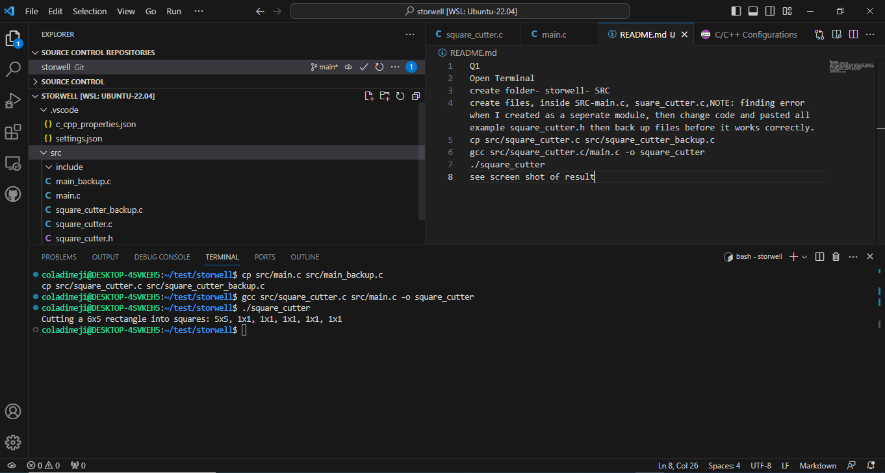

Q1 
Open Terminal 
create folder- storwell- SRC
create files, inside SRC-main.c, suare_cutter.c,NOTE: finding error when I created as a seperate module, then change code and pasted all example square_cutter.h then back up files before it works correctly.
cp src/square_cutter.c src/square_cutter_backup.c
gcc src/square_cutter.c/main.c -o square_cutter
./square_cutter
see screen shot of result
